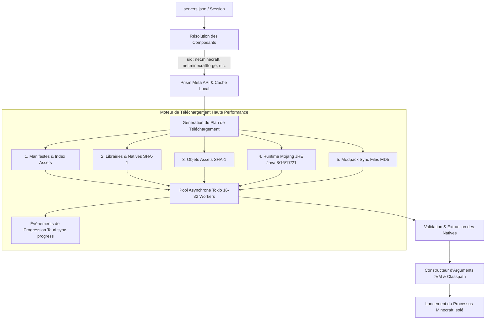

# Plan d'implémentation : Moteur de téléchargement et d'exécution universel (Inspiré de Prism Launcher / MultiMC)

**Date :** 2026-08-20  
**Statut :** `pending`  
**Objectif :** Remplacer le système d'installation fragile actuel par un moteur modulaire haute performance inspiré de Prism Launcher / MultiMC, compatible avec toutes les versions de Minecraft (de 1.0.0 à 26.2+) et tous les mod loaders majeurs (Forge, NeoForge, Fabric, Quilt), avec téléchargement multithreadé vérifié par checksum, isolation stricte des runtimes Java Mojang officiels, et préservation intégrée de la synchronisation de fichiers modpack (MD5 / `sync_dir`).

---

## 1. Contexte & Problématique

Le launcher actuel souffrait de plusieurs faiblesses structurelles :
1. **Forge moderne & Legacy :** L'exécution en sous-processus de l'installateur Forge (`--installClient`) est fragile, échoue souvent en tâche de fond, dépend de JREs non isolés et ne gère pas proprement les processeurs de modules ni NeoForge.
2. **Téléchargement séquentiel et fragile :** Les librairies et assets étaient téléchargés un par un sans parallélisation de masse, avec des risques de corruption de fichiers (absence de validation systématique SHA-1).
3. **Multiplicité des versions de Minecraft & Loaders :** Minecraft a radicalement changé de format d'arguments et de packaging au fil des âges (1.0 à 1.12 legacy launchwrapper, 1.13 à 1.16 install profile, 1.17+ modular bootstrap launcher, 1.20.5+ Java 21, Fabric Knot, Quilt, NeoForge).

**Solution retenue (validée lors du cadrage) :**
- Adopter l'architecture par **composants modulaires** de Prism Launcher (`meta.prismlauncher.org/v1/`).
- Construire un **moteur de téléchargement asynchrone multithreadé** (16-32 workers Tokio) avec validation SHA-1/MD5 et retry exponentiel.
- Intégrer un **gestionnaire JRE Mojang officiel isolé** (Java 8, 16, 17, 21+) garantissant le bon runtime sans pollution du système.
- **Fusionner dynamiquement les composants** au lancement pour générer un Classpath exact, extraire les natives OS et injecter les JVM/Game arguments adéquats.
- **Unifier la synchronisation modpack** (`sync_dir`, `sync_url`, MD5) sur ce même moteur de téléchargement haute performance.

---

## 2. Architecture & Flux de Données

---

## 3. Projection Architecturale

### Fichiers à Modifier :
- `src-tauri/Cargo.toml` : Ajout des dépendances `sha1 = "0.10"`, `futures = "0.3"`.
- `src-tauri/src/core/session.rs` : Support du schéma de composants générique `components: Option<Vec<ComponentSpec>>` + rétrocompatibilité transparente (`minecraft`, `forge`, `fabric`, `neoforge`, `quilt`).
- `src-tauri/src/core/sync.rs` : Intégration sur le moteur de téléchargement unifié pour la synchronisation du modpack.
- `src-tauri/src/core/launch/args.rs` : Refonte de la fusion des composants et construction des arguments (classpath, JVM args, game args, traits, natives).
- `src-tauri/src/core/install/mod.rs` : Orchestration de l'installation modulaire (meta -> assets -> libraries -> runtime).
- `src-tauri/src/lib.rs` : Liaison des commandes Tauri avec le nouveau pipeline.

### Fichiers à Créer :
- `src-tauri/src/core/download/mod.rs` : Module de téléchargement.
- `src-tauri/src/core/download/engine.rs` : Moteur de pool asynchrone multithreadé avec file d'attente, reprise sur erreur, validation de hash (SHA-1/MD5) et streaming de progression.
- `src-tauri/src/core/meta/mod.rs` : Module de gestion des métadonnées de composants.
- `src-tauri/src/core/meta/models.rs` : Structures serde des composants Prism Meta (ComponentIndex, ComponentVersion, LibraryItem, Artifact, ArgumentRule, etc.).
- `src-tauri/src/core/meta/prism.rs` : Client API Prism Meta avec mise en cache disque locale dans `.minecraft/meta/` et résolveur de fallback officiel.
- `src-tauri/src/core/install/runtime.rs` : Gestionnaire et installateur des runtimes Mojang officiels (`java-runtime-delta`, `java-runtime-gamma`, `java-runtime-alpha`, `jre-legacy`) avec permissions exécutables.
- `src-tauri/src/core/install/assets.rs` : Téléchargeur d'assets Mojang (index + objets).

### Fichiers à Supprimer / Déprécier :
- `src-tauri/src/core/install/forge.rs` : Remplacé par la résolution déclarative des composants Forge/NeoForge via Meta.
- `src-tauri/src/core/install/fabric.rs` : Remplacé par la résolution déclarative des composants Fabric/Quilt via Meta.
- `src-tauri/src/core/install/mojang.rs` : Remplacé par les modules modulaires `assets.rs`, `runtime.rs` et `engine.rs`.

---

## 4. Plan d'Exécution par Phases

### Phase 1 : Fondations, Dépendances & Moteur de Téléchargement Asynchrone
- Mettre à jour `Cargo.toml` (`sha1`, `futures`).
- Concevoir `core/download/engine.rs` :
  - Structure `DownloadTask` : URL source, chemin de destination, taille optionnelle, checksum attendu (type SHA1 ou MD5), permissions exécutables (Unix).
  - Pool de workers avec `tokio::sync::Semaphore` (concurrence paramétrable, défaut 24).
  - Gestion du retry avec backoff et bufferisation efficace.
  - Calculateur et émetteur d'avancement agrégé pour `sync-progress`.

### Phase 2 : Modèles & Client API Prism Meta (Composants Modulaires)
- Implémenter `core/meta/models.rs` et `core/meta/prism.rs` :
  - Support de `net.minecraft`, `net.minecraftforge`, `net.neoforged`, `net.fabricmc.fabric-loader`, `org.quiltmc.quilt-loader`.
  - Résolution des URLs Maven pour les librairies ne fournissant pas d'URL directe (avec cascades de dépôts Maven officiels : Minecraft, Forge, NeoForged, Fabric, Quilt, Sponge).
  - Mise en cache locale des manifestes JSON dans `.minecraft/meta/`.
  - Extension de `Session` dans `core/session.rs` pour parser à la fois `components: [...]` et les champs historiques (`minecraft`, `forge`, `fabric`, `neoforge`, `quilt`).

### Phase 3 : Gestionnaire de Runtimes Mojang & Assets
- Implémenter `core/install/runtime.rs` :
  - Téléchargement du JRE exact (`jre-legacy` pour Java 8, `java-runtime-alpha` pour Java 16, `java-runtime-gamma` pour Java 17, `java-runtime-delta` pour Java 21) directement dans `.minecraft/runtime/`.
  - Règle stricte : pas de fallback sur un Java système non contrôlé si aucun chemin personnalisé n'est fourni par l'utilisateur.
- Implémenter `core/install/assets.rs` :
  - Téléchargement du manifest d'index d'assets Mojang.
  - Mise en file de l'ensemble des objets d'assets (`assets/objects/xx/hash`) dans le moteur de téléchargement.

### Phase 4 : Fusion Dynamique des Composants & Constructeur d'Arguments
- Refondre `core/launch/args.rs` :
  - Fusion ordonnée des composants d'une session :
    1. Base `net.minecraft`
    2. Mod loader (`net.minecraftforge` / `net.neoforged` / `net.fabricmc.fabric-loader` / `org.quiltmc.quilt-loader`)
  - Construction du Classpath (respect des règles OS, exclusion des doublons).
  - Extraction sélective des natives dans `.minecraft/versions/<version>/<version>-natives/`.
  - Fusion des arguments JVM (`+jvmArgs`, `-jvmArgs`, placeholders).
  - Fusion des arguments de jeu (`+gameArgs`, placeholders auth, session, gameDir, assetsDir).
  - Remplacement dynamique de la `mainClass`.
  - Support garanti de toutes les versions (de 1.0.0 à 1.20+, 1.21 et 26.2).

### Phase 5 : Intégration de la Synchronisation Modpack & Commandes Tauri
- Adapter `core/sync.rs` pour confier le téléchargement des fichiers de modpack au moteur `DownloadEngine` avec vérification MD5.
- Connecter le pipeline d'installation dans `core/install/mod.rs` et `lib.rs` (`sync_session`, `launch_game`).
- Vérifier la fluidité des événements d'avancement (`sync-progress`) vers l'UI.

---

## 5. Plan de Vérification & Tests

### Tests Automatisés & Compilation :
- Compilation sans avertissement ni erreur du workspace Rust (`cargo check`, `cargo test`).
- Tests unitaires sur le parsing des composants Prism Meta, le calcul de hash SHA-1/MD5, et la résolution de chemins Maven.

### Tests de Validation Fonctionnelle (Scénarios Clés) :
1. **Minecraft Vanilla 1.20.1 & 1.21+ / snapshots** : Installation propre des assets, librairies, JRE 17/21 et lancement sans accroc.
2. **Legacy Forge (1.7.10 / 1.12.2)** : Résolution des librairies legacy, extraction des natives, JRE 8 automatique, lancement avec FML Launchwrapper.
3. **Modern Forge & NeoForge (1.20.1 / 1.20.4 / 1.20.6 / 1.21+)** : Résolution des librairies modulaires, mainClass BootstrapLauncher / FmlClientLaunchHandler, JRE 17/21, aucun conflit de client JAR.
4. **Fabric & Quilt** : Résolution des composants loader Fabric/Quilt et lancement avec KnotClient.
5. **Modpack Sync** : Synchronisation rapide de dossiers (mods, config) avec vérification MD5 et nettoyage des fichiers obsolètes.
