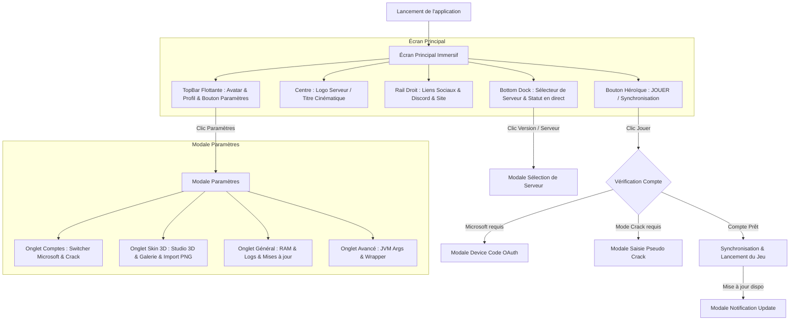

# Plan d'Implémentation : Refonte Totale de l'Interface Utilisateur (UI Redesign)

## 1. Contexte & Objectifs

L'objectif est de refondre entièrement l'interface graphique du launcher pour créer une expérience visuelle **Dark Minimaliste & Glassmorphism Premium** (type Linear / Raycast / Apple UI), tout en éliminant tous les emojis résiduels et en conservant 100% de la compatibilité avec la logique métier et les commandes Tauri existantes.

### Principes Clés
1. **Élégance Visuelle & Verre Dépoli** : `backdrop-blur-2xl`, arrière-plans sombres `bg-neutral-950`, bordures subtiles `border-white/10`, effets d'éclairage et ombres diffuses.
2. **Iconographie Vectorielle Propre** : Standardisation complète sur `lucide-react` (zéro emoji dans toute l'application).
3. **Micro-Interactions Fluides** : Transitions douces avec `framer-motion` (entrées spring, retours tactiles au survol et au clic, jauges de progression dynamiques).
4. **Zéro Régression** : Tous les hooks et handlers (`syncAndLoad`, sélecteur de session, auth Microsoft, skins 3D, mise à jour, switch de comptes, RAM/JVM) restent connectés à l'identique.
5. **Code Propre & Allégé** : Purge des 1300+ lignes de code CSS obsolète au profit de Tailwind CSS v4 et de composants React réutilisables.

---

## 2. Parcours Utilisateur (Mermaid Flow)

---

## 3. Découpage des Phases & Tâches Macro

### Phase 1 : Fondations & Dépendances
- [ ] Installer `lucide-react` dans `package.json`.
- [ ] Purger `src/assets/style.css` des 1300+ lignes d'ancien code CSS et définir les utilitaires modernes (scrollbars personnalisées, animations de lueur, variables).
- [ ] Créer les composants d'interface réutilisables ultra-propres : `src/components/ui/Slider.tsx` et `src/components/ui/Switch.tsx`.

### Phase 2 : Écran Principal & HUD Flottant
- [ ] **TopBar** : Refondre la pilule de compte (avatar Minecraft, nom du joueur, statut du compte) et le bouton de réglages avec icône Lucide `Settings` et animation de rotation.
- [ ] **MainScreen** : Optimiser la gestion du fond cinématique (cross-fade aléatoire fluide, vignettes sombres multi-niveaux, logo de session centré).
- [ ] **SocialLinks** : Refondre le rail vertical de liens avec icônes Lucide / favicons vectoriels et tooltips flottants.
- [ ] **BottomBar** : Refondre le sélecteur de session (statut en ligne/hors-ligne, ping, joueurs) et le bouton géant **JOUER** avec intégration soignée de la jauge de synchronisation et des pourcentages.

### Phase 3 : Modales Fonctionnelles
- [ ] **ServerSelectModal** : Refonte complète avec cartes de serveurs en verre dépoli, badges de versions (Minecraft, Forge/NeoForge/Fabric), indicateur de serveur favori et état sélectionné sans aucun emoji.
- [ ] **MicrosoftDeviceCodeModal** : Affichage net du code de connexion avec bouton de copie instantanée et retour visuel "Copié !", bouton d'ouverture de l'URL dans le navigateur.
- [ ] **CrackModal** : Modale d'authentification crackée avec champ de saisie dynamique, autofocus et validation.
- [ ] **UpdatePromptModal** : Modale d'alerte de mise à jour du launcher avec notes de version et progression du téléchargement.

### Phase 4 : Modale Paramètres & Studio Skin 3D
- [ ] **SettingsModal** : Structure en verre dépoli avec header premium, barre d'onglets segmentés avec icônes Lucide (`Users`, `Palette`, `Sliders`, `Terminal`), et pied de page avec version.
- [ ] **AccountSwitcher** : Liste des comptes connectés avec badges actifs, boutons de changement rapide et d'ajout de compte Microsoft.
- [ ] **SettingsGeneralTab** : Contrôles de RAM fluides via le composant `Slider`, bascule des logs via `Switch`, et panneau de vérification/installation des mises à jour.
- [ ] **SettingsAdvancedTab** : Zones de texte stylisées pour les arguments JVM et wrapper.
- [ ] **SkinTab & Skin3DViewer** : Studio 3D avec socle sombre, contrôles d'animation (Marche / Pause / Reset) avec icônes Lucide, sélecteur de modèle Steve / Alex, zone de glisser-déposer de PNG avec validation instantanée et galerie de skins.

### Phase 5 : Vérification, Validation & Documentation
- [ ] Vérifier la compilation TypeScript (`npm run build`).
- [ ] Valider l'absence totale d'emojis résiduels.
- [ ] Vérifier le branchement complet avec les handlers Tauri et les états React.
- [ ] Mettre à jour `DESIGN.md`.

---

## 4. Évaluation de Confiance & Risques

- **Score de Confiance** : 10/10
- **Points Forts (✓)** :
  - La logique métier et le state manager (`state.ts`, `launcher-controller.ts`, `services/`) sont parfaitement découplés des composants visuels.
  - La stack Tailwind CSS v4 + Framer Motion + Lucide React garantit une UI ultra-rapide, réactive et sans dette technique.
  - Toutes les exigences utilisateur ont été clarifiées et validées via l'interview `/grill-me`.
- **Gestion des Risques (✗)** :
  - Les écouteurs de sauvegarde de paramètres doivent rester debouncés pour éviter les écritures disque intempestives (préservé dans le nouveau design).
  - Le canvas 3D `skinview3d` doit conserver ses dimensions et son cycle de vie pour ne pas bloquer les rendus.
