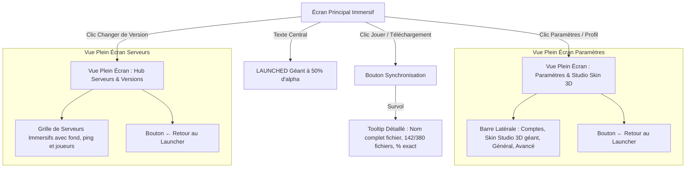

# Plan d'Implémentation : Vues Plein Écran & Perfectionnements UI

## 1. Contexte & Objectifs

Suite aux retours utilisateur :
1. **Suppression du système de modales popup** au profit de **Vues Plein Écran Immersives (Full-Page Views)** pour les Paramètres, le Studio de Skin 3D et le Sélecteur de Serveurs.
2. **Infobulle de Téléchargement Détaillée** : Affichage au survol d'un tooltip élégant en verre dépoli contenant le nom complet du fichier sans coupure tronquée, le ratio de fichiers (`files_done / total_files`) et le pourcentage.
3. **Typographie Monumentale "LAUNCHED"** : Titre géant au centre de l'écran occupant l'espace avec une opacité de 50% (`text-white/50`) pour sublimer l'arrière-plan cinématique de chaque session.

---

## 2. Parcours Utilisateur

---

## 3. Découpage des Tâches

### Phase 1 : Typographie Monumentale LAUNCHED & Tooltip Téléchargement
- [ ] Modifier `src/screens/MainScreen.tsx` pour afficher systématiquement `LAUNCHED` en grand format (taille géante, `text-white/50`, `font-black tracking-tighter drop-shadow-2xl`).
- [ ] Modifier `src/components/BottomBar.tsx` pour intégrer un tooltip détaillé au survol de la barre de progression/bouton affichant le nom de fichier complet (`break-all`), le ratio de fichiers et le pourcentage.

### Phase 2 : Vue Plein Écran des Paramètres & Studio Skin 3D
- [ ] Transformer `src/components/settings/SettingsModal.tsx` en une vue plein écran immersive avec sidebar latérale de navigation, grand espace dédié pour le Studio de Skin 3D, formulaires aérés et bouton de retour élégant.
- [ ] Ajuster `src/components/skin/SkinTab.tsx` pour exploiter l'espace plein écran (viewer 3D agrandi, galerie plus spacieuse).

### Phase 3 : Vue Plein Écran du Sélecteur de Serveurs
- [ ] Transformer `src/components/ServerSelectModal.tsx` en une vue plein écran immersive (Hub Serveurs) avec grille de cartes riches et bouton de retour.

### Phase 4 : Validation & Tests
- [ ] Vérifier la compilation TypeScript (`npm run build`).
- [ ] Mettre à jour `DESIGN.md`.
